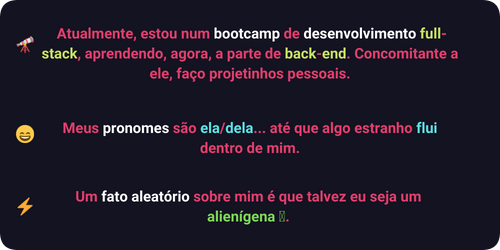

  
  <h1>
    Olá! Seja bem-vindx ao meu repositório! 🌱
  </h1>
  
  

    Aqui você encontrará de projetos apressados da vida de uma estudante de web-development à outros projetos apressados, que provavelmente fazem parte da minha vida de estudante também, mas que eu não gosto muito de assumir.
  

  
  <h2 align="left">Coisas sobre mim</h2>

  
  

    
    
  

 
   

<h2 align="left">Status e Habilidades</h2>
  

  
  

   
  
  
  
  
  

#
<h2 align="left">📫 Encontre-me! </h2>

                                                                                                  

